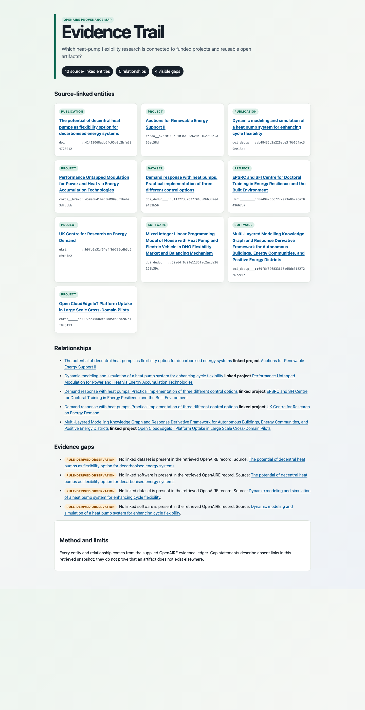

# Evidence Trail

Build and submit a provenance-rich OpenAIRE Graph evidence mapping tool for the 2026 OpenAIRE AI Hackathon.

Evidence Trail turns a research question and source-backed OpenAIRE records into an auditable map of
publications, datasets, software, and funded projects. It never fills missing relationships with AI
guesses: absent artifact links remain visible, bounded observations.

## Live demo

- [Public repository](https://github.com/QuanticFlare/openaire-evidence-trail)
- [Hosted standalone demo](https://quanticflare.github.io/openaire-evidence-trail/docs/demo/evidence-trail-live.html)
- [Standalone HTML evidence map](docs/demo/evidence-trail-live.html)
- [Markdown decision brief](docs/demo/evidence-trail-live.md)
- [Sanitized live MCP ledger](examples/mcp-heat-pump-live.json)
- [1–2 page submission story](docs/submission-story.md)



The demo was retrieved through the official Alien Intelligence MCP gateway using live OpenAIRE Graph
API V3 tools on 20 August 2026. It contains exact public identifiers and returned relationships, but
no credential, private invitation, mailbox content, or private configuration URL. See the
[live MCP smoke evidence](docs/spikes/mcp-live-smoke-2026-08-20.md).

## Run it

Python 3.11 or later is required. The core has no runtime dependencies.

```bash
python3 -m venv .venv
.venv/bin/pip install -e .
.venv/bin/evidence-trail --input examples/mcp-heat-pump-live.json --format html --output evidence-trail.html
```

JSON and Markdown exports use the same command:

```bash
.venv/bin/evidence-trail --input examples/mcp-heat-pump-live.json --format json
.venv/bin/evidence-trail --input examples/mcp-heat-pump-live.json --format markdown
```

For a zero-install checkout:

```bash
PYTHONPATH=src python3 -m evidence_trail --input examples/mcp-heat-pump-live.json --format html
```

## What the mapper guarantees

- Every node requires an OpenAIRE identifier, title, type, and public source URL.
- Related entities without a public source URL are rejected.
- Shared entities are deduplicated by identifier while all returned relationships are retained.
- Missing dataset/software links are labelled only for publications.
- JSON, Markdown, and HTML outputs are deterministic and generated from the same evidence map.

## Architecture

The application deliberately separates transport from evidence logic:

1. The official Alien/OpenAIRE MCP supplies live records and relationships.
2. A sanitized JSON ledger is the reproducible transport boundary.
3. `build_evidence_map` validates provenance, deduplicates entities, and records relationships.
4. Deterministic renderers produce machine-readable JSON and judge-facing Markdown/HTML.

The current artifact uses a bounded, sanitized MCP snapshot so evaluators can reproduce the demo
without private OAuth access. Pagination, retry, timeout, and rate-limit handling are documented
future adapter work, not hidden as completed functionality.

## Verify

```bash
PYTHONPATH=src python3 -m unittest discover -s tests -v
```

## Responsible use and limitations

Evidence Trail reports OpenAIRE metadata and recorded links; it does not judge research quality,
scientific consensus, causality, or funding impact. “Missing” means no relationship appeared in the
retrieved snapshot, not that no artifact exists. It does not retrieve paywalled full text. The live
MCP workflow is read-only, uses bounded result pages, and disables the gateway's profile-writing tool.

## Licensing

Python code is available under the [MIT License](LICENSE). Documentation, examples, generated reports,
and submission materials are available under [CC BY 4.0](LICENSE-DOCS.md).

## Delivery plan

The executable plan is maintained as checkable, evidence-gated tickets in [TICKETS.md](TICKETS.md). The intended Build-track artifact is **Evidence Trail**: a research-question workflow that maps OpenAIRE publications, datasets, software, projects, funders, supporting evidence, contradictions, and missing links without making untraceable claims.
